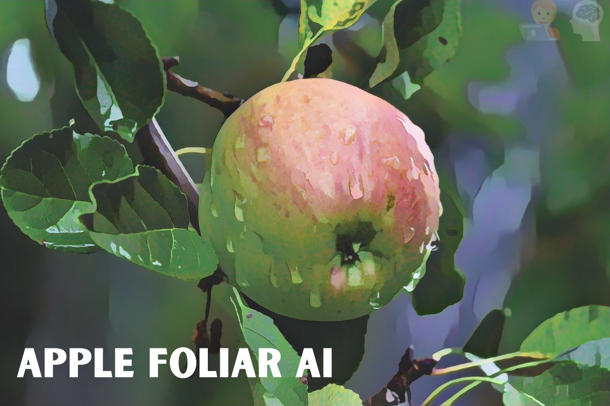

<h1 align = "center">Apple Foliar AI</h1>

<p align = "center"></p>

## Background:

Apple is a widely consumed fruit across the world which has over 7500 cultivars in temperate and subtropical climates. Not only do they hold paramount importance for people's dietary requirements but also drive profitable businesses in several nations. The production and distribution of apples is often hindered by foliar diseases. Currently, the workers on the orchards do scouting to manually identify these diseased leafs and segregate them. For large scale orchards, this eventually turns out to be cumbersome and resource demading. Hence there is a requirement for an automated system to assist in this problem. We propose the use of neural network based algorithms to tackle this issue of diagnosis.

## Data:

We would be making use of the Plant Pathology dataset[1] used in the Eight Workshop on Fine-Grained Visual Categorization held in conjuction with CVPR 2021.

The dataset is structured as follows:

```terminal
|
|-- train images
|-- train.csv : CSV file comprising metadata for training images
      |
      |-- image ID: Basically name of the images
      |
      |-- labels: disease that the apple leaf is diagnosed with
|-- test images: 5003 images
|-- sample_submission.csv: Similar to train.csv. To be populated after training the model on the train images and getting inference on the test images
```

Our training data is classified into the following categories:

| Foliar Disease Condition        | Number of Images |
| ------------------------------- | :--------------: |
| Scab                            |       4826       |
| Healthy                         |       4624       |
| frog_eye_leaf_spot              |       3181       |
| Rust                            |       1860       |
| Complex                         |       1602       |
| Powdery_mildew                  |       1184       |
| scab frog_eye_leaf_spot         |       686        |
| scab frog_eye_leaf_spot complex |       200        |
| frog_eye_leaf_spot complex      |       165        |
| rust frog_eye_leaf_spot         |       120        |
| rust complex                    |        97        |
| powdery_mildew complex          |        87        |

## Usage:

- Clone this repository

```
git clone https://github.com/smaranjitghose/AppleFoliar.ai.git
```

- Move inside the AppleFoliar.AI directory

```
cd AppleFoliar.ai
```

#### Setting up code quality and formatting for the project [This is required only when one plans to contribute to the project]

- Install pre-commit package

```
pip install pre-commit
```

- Setup pre-commit hooks as per the desired configurations of the project

```
pre-commit install
```

- Check if pre-commit is working

```
pre-commit run
```

#### For running inference on a sample image:

```
python src/inference.py --input path_to_image
```

## Planned work:

- [] Experimentation and Logging of ML models
- [] StreamLit Application
- [] React + SCSS + Bootstrap5 Front
- [] TFJS Inference
- [] Containerization
- [] Documentation

## The geeks🤓 behind this initiative:

### Our hard-working Project Maintainers👨‍🏫:

|  |  |   | 
| :-------------------------------------------------------: | :-------------------------------------------------------: | :---------------------------------------------------: | 
|   [Smaranjit Ghose](https://github.com/smaranjitghose)    |      [Anush Bhatia](https://github.com/anushbhatia)       | [Aditya Jytoi Paul](https://github.com/phreakyphoenix)       |

#### Our valuable Contributors👩‍💻👨‍💻 :

<a href="https://github.com/smaranjitghose/awesome-portfolio-websites/graphs/contributors">
  
</a>

## Documents related to the project:

- [LICENSE](./LICENSE)
- [CODE OF CONDUCT](./CODE_OF_CONDUCT.md)
- [CONTRIBUTION GUIDELINES](./CONTRIBUTING.MD)
- [CHANGELOG](./CHANGELOG.md)

## References:

1. ```
   Thapa, Ranjita; Zhang, Kai; Snavely, Noah; Belongie, Serge; Khan, Awais. The Plant Pathology Challenge 2020 data set to classify foliar disease of apples. Applications in Plant Sciences, 8 (9), 2020.
   ```
